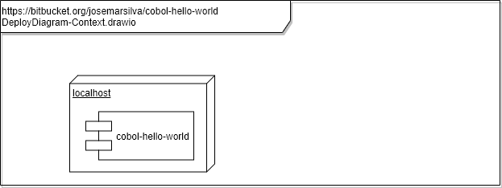

# README - cobol-hello-world
Cobol Simple Program

## 1. Introdução

Este repositório contém o fonte do programa **cobol-hello-world**. Programa que faz um display "hello, Cobol World!".


## 2. Documentação

### 2.1. Diagrama de Caso de Uso

 


### 2.2. Diagrama de Implantação

 


### 2.3. Diagrama de Processos BPMN

* n/a

## 3. Projeto

### 3.1. Pré-condições

* [Cobol para Linux Ubuntu instalado](https://github.com/josemarsilva/eval-virtualbox-vm-ubuntu-server#321-transmission-cli)


### 3.2. Guia para Desenvolvedores

* Clone o projeto usando `git clone`. Use a _branch_ `master` se a _branch_ `develop` não estiver disponível
* Faça suas alterações na _branch_ `develop` quando disponível. Peça permissão de escrita caso falte.


### 3.3. Guia de Configuração

* n/a


### 3.4. Guia para Teste

* n/a


### 3.5. Guia para Implantação

* Compile programa `cobol-hello-world.cbl` e gerando executável `cobol-hello-world.exe`

```sh
$ cobc -free -x -o cobol-hello-world.exe cobol-hello-world.cbl
```

* Transfira o binário executável (.exe) para a máquina onde ele deve executar

```sh
$ ls -la cobol-hello*
-rw-rw-r-- 1 ubuntu ubuntu   126 Feb  1 14:55 cobol-hello-world.cbl
-rwxrwxr-x 1 ubuntu ubuntu 13200 Feb  1 14:55 cobol-hello-world.exe
```


### 3.6. Guia de demonstração

* Execute o programa

```sh
$ ./cobol-hello-world.exe
hello, Cobol World!
```


### 3.7. Padrões, Convenções e Melhores Práticas

* n/a
